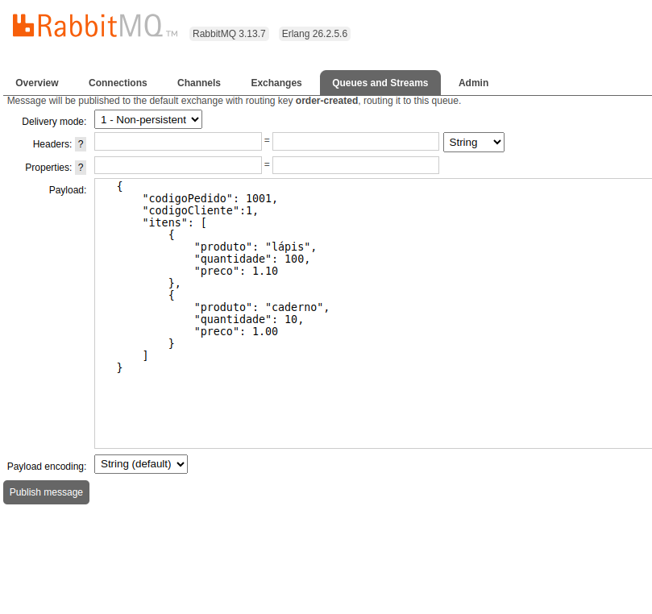
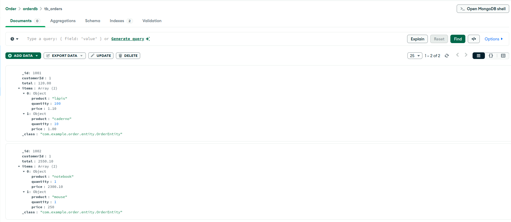
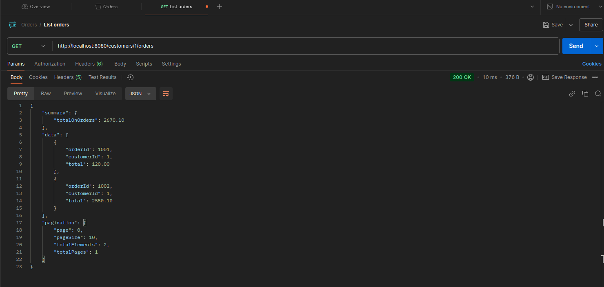
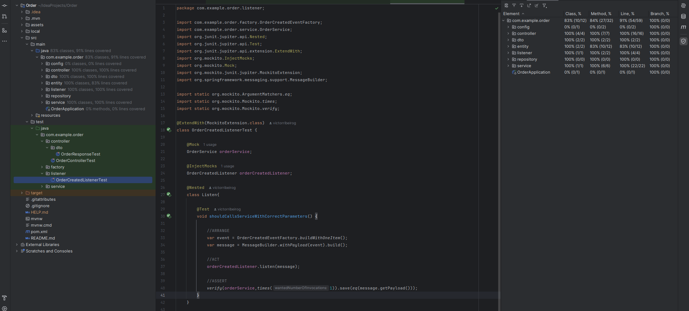

# OrdersAPI

OrdersAPI é um microserviço desenvolvido para processar pedidos e fornecer uma API REST para consultas relacionadas ao pedidos do cliente. O projeto também implementa a funcionalidade adicional de calcular o valor total de todos os pedidos realizados por cliente.

---

## ✨ Funcionalidades

1. **Processamento de Pedidos**
   - Consome mensagens de uma fila RabbitMQ com informações de pedidos.
   
   - Persiste os dados em uma base MongoDB para consulta posterior.

     

1. **API REST**
   - Listagem de pedidos por cliente.
   - Consulta do valor total de todos os pedidos de um cliente.

---

## 🛠️ Tecnologias Utilizadas

- **Linguagem de Programação**: Java 21  
- **Banco de Dados**: MongoDB  
- **Mensageria**: RabbitMQ  
- **Contêineres**: Docker  

---

## 📃 Endpoint da API

### **Listagem de Pedidos por Cliente**
- **GET** `/customers/{customerId}/orders`  
- **Descrição**: Lista os pedidos realizados por um cliente, incluindo o valor total de todos os pedidos.


---

🔧 Testes

Os testes foram implementados utilizando as seguintes abordagens e ferramentas:

Padrão Triple A (Arrange/Act/Assert): Seguido para garantir clareza na estrutura dos testes.

JUnit: Utilizado para criar cenários de teste e verificar os comportamentos esperados.

Mockito: Usado para mockar interações e simular dependências externas.

@Nested: Utilizado para organizar os testes em grupos lógicos, facilitando a leitura e manutenção do código.




---

## 🛠️ Estrutura do Projeto

```plaintext
src/
├── config/         # Configurações (RabbitMQ, MongoDB)
├── controller/     # Controladores para a API REST e DTOs de resposta
├── dto/            # Objetos auxiliares
├── entity/         # Entidades de domínio
├── listener/       # Consumidores de mensagens do RabbitMQ
├── repository/     # Camada de acesso aos dados (MongoDB)
├── service/        # Lógica de negócios
└── ...             # Outros diretórios auxiliares
```

--- 

💻 Desenvolvido por [Victor Ribeiro](https://github.com/victorribeirog).
